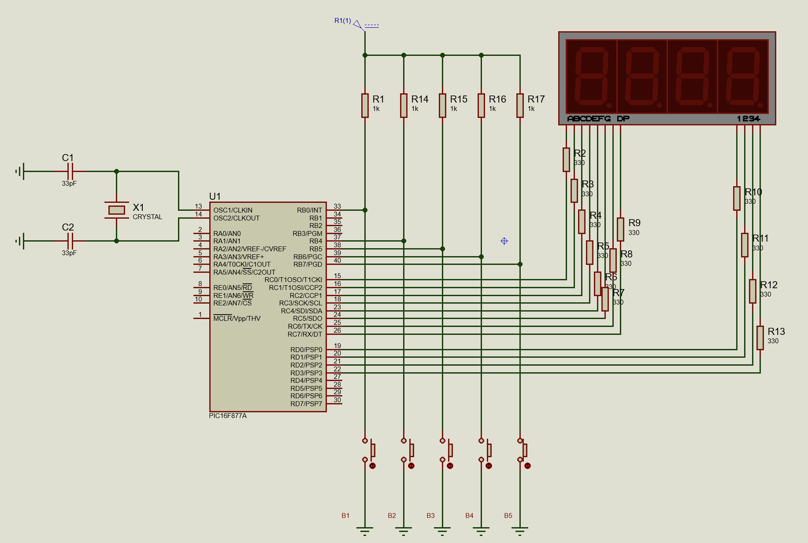

# **PIC16F877A Digital Clock using Multiplexed 7-Segment Displays**

This project demonstrates how to build a digital clock using a PIC16F877A microcontroller and multiplexed 7-segment displays. The clock displays time in hours, and minutes, and includes features such as setting the time and a blinking colon to separate the hours and minutes.

## **Table of Contents**

- [Requirements](#requirements)
- [Features] (#features)
- [Installation](#installation)
- [Usage](#usage)
- [Contributing](#contributing)

## **Features**
The PIC16F877A digital clock has the following features:

## **Requirements**

To build and run this project, you will need:

- 1 5V power supply
- PIC16F877A microcontroller
- 4-digit 7-segment display (common anode or common cathode)
- 12 330 Ω resistors
- 4 1 kΩ resistors
- 4 push buttons
- 1 20 MHz crystal
- 2 22 pF capacitor
- Breadboard
- Jumper wires
- PIC programmer (PICkit3 or similar)
- Proteus 8 Professional or similar
- MPLAB X IDE software or similar
- XC8 compiler

## **Installation**

1. Connect the components on a breadboard as shown in the circuit diagram below:

2. Download or clone this repository to your computer.
3. Open the project folder in MPLAB X IDE software.
4. Build and program the project using your PIC programmer.

## **Usage**

1. Power on the circuit by connecting a 5V power supply to the VCC and GND pins.
2. The clock will display the current time in hours, and minutes.
3. To set the time, press the Set Time button. The hours will start blinking.
4. Use the Increase and Decrease buttons to set the hours. Press Set Time again to move to minutes and repeat the process.
5. After setting the time, press Set Time one more time to return to normal clock mode.

## **Contributing**

Contributions to this project are welcome. If you would like to contribute, please fork the repository and submit a pull request. For major changes, please open an issue first to discuss what you would like to change.